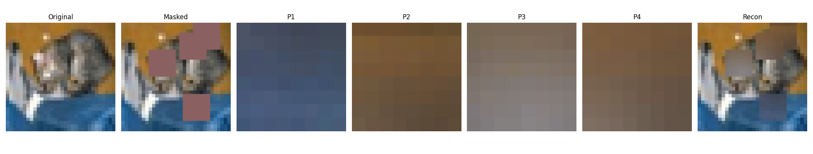

# MiniJEPA — Self-Supervised Image Patch Prediction

📊 **[View the Project Presentation (PDF)](resources/JEPA_Presentation.pdf)**

A minimalist implementation of the **Joint Embedding Predictive Architecture (JEPA)** for hidden image patch prediction, trained on CIFAR-10.

The model learns to predict the **latent embedding** of a masked image region from its surrounding context — without relying on pixel-level reconstruction alone.



---

## Project Structure

```
IJEPA/
├── models/                     # PyTorch model definitions
│   ├── encoder.py
│   ├── predictor.py
│   └── decoder.py
├── frontend/                   # Vite/React frontend
├── notebooks/                  # Jupyter notebooks
│   └── MiniJEPA_Colab_Training.ipynb
├── data/                       # Data directory
├── outputs/                    # Training outputs and checkpoints
├── app.py                      # FastAPI demo app
├── infer.py                    # Inference script
├── train.py                    # Training script
├── utils.py                    # Helper functions
├── requirements.txt            # Python dependencies
├── README.md                   # Documentation
├── resources/                  # Assets and documentation
│   ├── JEPA_Presentation.pdf   # Slide deck
│   └── Example.png             # Example image
```

---

## Features

- Randomly masks a patch from an image.
- Encodes visible context.
- Predicts latent embedding of the hidden patch.
- Decodes predicted embedding to pixels for visualization.
- Produces a qualitative panel: original, masked, predicted patch, reconstructed image.
- Includes a lightweight FastAPI demo API.

## How It Works

1. A random square patch is **masked** (hidden) from an image
2. The **context encoder** (ResNet18) encodes the visible region into an embedding
3. The **predictor** estimates the latent embedding of the hidden patch given mask position
4. The **decoder** reconstructs the missing pixels from the predicted embedding

**Loss**: Embedding MSE (JEPA objective) + pixel reconstruction MSE

---

## Quickstart — Google Colab ⭐ (Recommended)

[](https://colab.research.google.com/github/AlaaBelga/IJEPA/blob/main/notebooks/MiniJEPA_Colab_Training.ipynb)

The notebook includes:
- ✅ Model definitions (encoder, predictor, decoder)
- ✅ CIFAR-10 data loading
- ✅ Full training loop with EMA target encoder
- ✅ Visualization panel: Original → Masked → Predicted Patch → Reconstructed

---

## Local Setup

```bash
python -m venv .venv
source .venv/bin/activate  # Windows: .venv\Scripts\activate
pip install -r requirements.txt
```

### Train

**CIFAR-10**:
```bash
python train.py --dataset cifar10 --epochs 20 --batch_size 128 --patch_size 8
```

**MNIST**:
```bash
python train.py --dataset mnist --epochs 10 --batch_size 128 --patch_size 7
```

Training outputs are saved in `outputs/`:
- `mini_jepa.pt` checkpoint
- `training_curve.png`
- `sample_prediction.png`

### Inference

**Use random test sample**:
```bash
python infer.py --checkpoint outputs/mini_jepa.pt
```

**Use your own image**:
```bash
python infer.py --checkpoint outputs/mini_jepa.pt --input path/to/image.png --output outputs/custom_prediction.png
```

### Run Demo App (FastAPI + Gradio)

```bash
python app.py --checkpoint outputs/mini_jepa.pt
```

Open `http://127.0.0.1:8000` in your browser.

The server exposes:
- `GET /api/health` for a quick status check.
- `POST /api/predict` for image-upload inference.

The API expects a masked image with a clear missing square region. It will detect the hole, predict the missing patch, and return the completed image plus a preview panel as data URLs. This backend is ready to sit behind a React/Vite client if you want a custom UI later.

---

## Architecture

| Component | Details |
|---|---|
| **Encoder** | ResNet18 pretrained on ImageNet (adapted for 32×32) |
| **Predictor** | 3-layer MLP with LayerNorm |
| **Decoder** | Transposed-conv decoder with residual blocks |
| **Target Encoder** | EMA copy of the context encoder (frozen) |
| **Dataset** | CIFAR-10 (auto-downloaded) |
| **Patch size** | 8×8 pixels |
| **Embedding dim** | 512 |

---

## JEPA Objective

MiniJEPA minimizes embedding prediction error:

$$
\mathcal{L}_{\text{embed}} = \| z_{\text{pred}} - z_{\text{target}} \|_2^2
$$

This implementation also adds a lightweight reconstruction loss for clearer visualizations.

---

## Key References

- [I-JEPA: Self-Supervised Learning from Images with a Joint-Embedding Predictive Architecture](https://arxiv.org/abs/2301.08243) — Assran et al., 2023

---

## Suggested Class Deliverables

1. Training script and model code.
2. Demo app screenshots or live demo.
3. Report comparing datasets and patch sizes.
4. Short presentation explaining JEPA intuition and results.

---

## Author

**Alaa Belga** — [@AlaaBelga](https://github.com/AlaaBelga)
